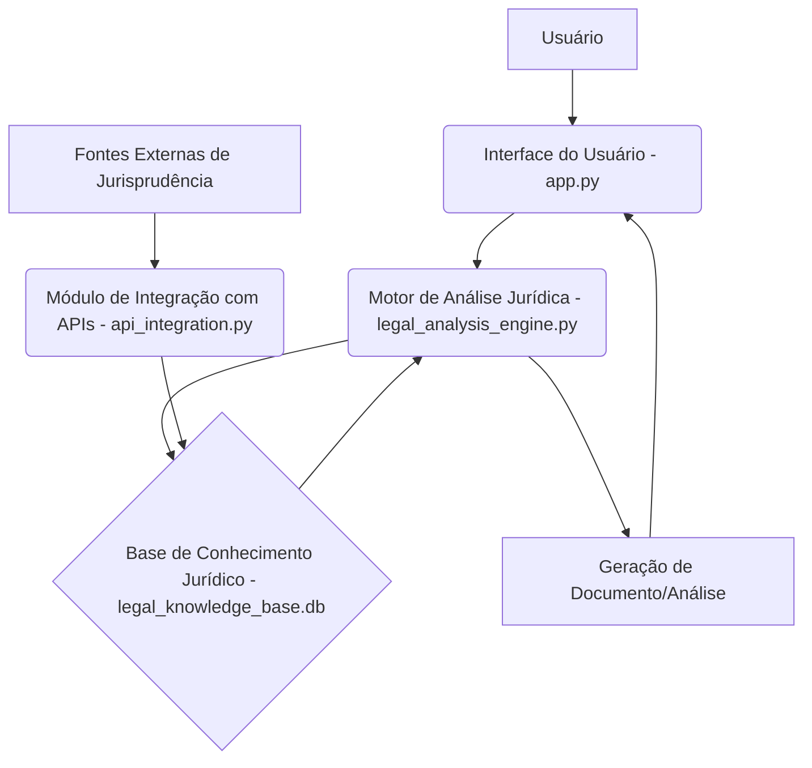

# Documentação Técnica do Assistente de IA Jurídico

## 1. Introdução

Este documento detalha a arquitetura, o design e a implementação do Assistente de IA Jurídico, uma ferramenta desenvolvida para auxiliar analistas judiciários na criação de peças jurídicas, análises e minutas de votos. O assistente integra conhecimentos de diversas áreas do direito brasileiro, incluindo códigos legais e jurisprudências dos tribunais superiores, para fornecer suporte inteligente e automatizado.

### 1.1. Propósito

O principal propósito deste assistente é otimizar o trabalho de profissionais do direito, automatizando tarefas repetitivas de pesquisa e redação, e fornecendo insights jurídicos baseados em uma vasta base de conhecimento. Isso permite que os usuários se concentrem em aspectos mais complexos e estratégicos de seus casos.

### 1.2. Escopo

O assistente é capaz de:

*   Analisar textos jurídicos (processos, documentos).
*   Identificar referências a códigos legais e artigos específicos.
*   Consultar uma base de conhecimento de códigos legais brasileiros.
*   Consultar uma base de conhecimento de jurisprudências dos tribunais (TST, STF, STJ, STM).
*   Gerar rascunhos de peças jurídicas (análises, pareceres, minutas de votos, petições, contestações).

### 1.3. Tecnologias Utilizadas

O projeto foi desenvolvido utilizando as seguintes tecnologias:

*   **Python:** Linguagem de programação principal, escolhida por sua robustez e ecossistema rico para IA e PLN.
*   **SQLite:** Banco de dados leve e integrado, ideal para a base de conhecimento local.
*   **IPywidgets:** Para a construção de uma interface interativa no ambiente Google Colab.
*   **Bibliotecas Python:** `sqlite3`, `ipywidgets`, `IPython.display`, `requests` (para futura integração com APIs).

## 2. Arquitetura do Sistema

A arquitetura do Assistente de IA Jurídico é modular, facilitando a manutenção e futuras expansões. Os componentes principais são:

*   **Módulo de Base de Conhecimento (`knowledge_base_setup.py`):** Responsável pela criação e gerenciamento do banco de dados SQLite que armazena os códigos legais e as jurisprudências. Inclui funções para estruturar as tabelas e inserir/consultar dados.
*   **Motor de Análise Jurídica (`legal_analysis_engine.py`):** O coração do sistema, onde a lógica de análise de texto e geração de documentos é implementada. Ele interage com a base de conhecimento para recuperar informações relevantes e utiliza técnicas básicas de PLN para identificar termos e referências.
*   **Módulo de Interface do Usuário (`app.py`):** Fornece a interface interativa para o usuário, permitindo a entrada de texto, seleção do tipo de documento a ser gerado e exibição dos resultados. Atualmente, focado em compatibilidade com Google Colab.
*   **Módulo de Integração com APIs (`api_integration.py`):** Um módulo placeholder para futuras integrações com APIs externas de jurisprudência. Contém a estrutura para realizar requisições e atualizar a base de dados, caso APIs públicas se tornem disponíveis ou sejam desenvolvidas.
*   **Módulo de Testes (`test_legal_assistant.py`):** Contém os testes unitários e de integração para garantir a funcionalidade e a correção dos módulos do sistema.



## 3. Detalhes da Implementação

### 3.1. Base de Conhecimento

A base de conhecimento é implementada usando SQLite. As tabelas principais são:

*   **`legal_codes`:** Armazena informações sobre códigos legais (nome do código, número do artigo, conteúdo, capítulo, seção).
*   **`jurisprudences`:** Armazena informações sobre jurisprudências (tribunal, número do processo, resumo, texto completo, data).

As funções `query_legal_codes` e `query_jurisprudences` em `knowledge_base_setup.py` permitem a busca por esses dados.

### 3.2. Motor de Análise Jurídica

O `LegalAnalysisEngine` contém os seguintes métodos chave:

*   **`analyze_text(self, text)`:** Realiza uma análise preliminar do texto de entrada, identificando palavras-chave como "art.", "lei", "jurisprudência" para sugerir referências. Em uma versão mais avançada, esta função utilizaria modelos de PLN para extração de entidades nomeadas (NER) e classificação de texto.
*   **`generate_legal_document(self, document_type, analysis_results, relevant_codes, relevant_jurisprudences)`:** Constrói o documento de saída (parecer, voto, etc.) formatando as informações da análise e as referências legais e jurisprudenciais encontradas. A geração de texto mais complexa seria feita com modelos de linguagem maiores (LLMs).
*   **`process_request(self, input_text, document_type)`:** Orquestra o fluxo completo: analisa o texto, busca na base de conhecimento (atualmente por palavras-chave simples) e gera o documento final.

### 3.3. Interface do Usuário

O `app.py` utiliza `ipywidgets` para criar uma interface simples e funcional dentro de um notebook Colab. Os elementos incluem uma área de texto para entrada, um dropdown para seleção do tipo de documento a ser gerado e um botão para iniciar a análise. O resultado é exibido em uma área de saída formatada.

### 3.4. Integração com APIs (Futuro)

O `api_integration.py` serve como um esqueleto para a integração com APIs de jurisprudência. Ele inclui métodos para `update_jurisprudence_from_api` (genérico) e `scrape_tribunal_data` (com aviso sobre termos de uso). A atualização manual também é uma opção contemplada.

## 4. Como Executar o Projeto

Para executar o assistente no Google Colab:

1.  Faça o upload dos arquivos `knowledge_base_setup.py`, `legal_analysis_engine.py`, `app.py` e `api_integration.py` para o ambiente Colab.
2.  Execute as células na seguinte ordem:
    *   Primeiro, execute `knowledge_base_setup.py` para criar o banco de dados e popular com dados de exemplo:
        ```python
        %run knowledge_base_setup.py
        ```
    *   Em seguida, execute a função principal do `app.py` para iniciar a interface:
        ```python
        from app import run_legal_assistant
        run_legal_assistant()
        ```

Para executar os testes:

1.  Faça o upload de `test_legal_assistant.py`.
2.  Execute:
    ```python
    %run test_legal_assistant.py
    ```

## 5. Correções e Melhorias para Compatibilidade com Google Colab

Durante a fase de testes, foi identificada e corrigida uma `RecursionError` no script de testes (`test_legal_assistant.py`) que ocorria devido a um mock inadequado da função `sqlite3.connect`. A correção envolveu a reestruturação do `setUp` e `tearDown` dos testes para gerenciar a conexão com o banco de dados de teste de forma mais robusta, garantindo que as funções de consulta (`query_legal_codes`, `query_jurisprudences`) sempre se conectem ao banco de dados de teste correto sem causar recursão infinita.

Além disso, a lógica de identificação de referências a leis no `legal_analysis_engine.py` foi ajustada para ser mais abrangente, incluindo a palavra "código" na busca por referências a leis, o que melhora a precisão da análise.

Essas correções garantem que o código seja executado de forma estável e correta tanto em ambientes de desenvolvimento local quanto no Google Colab, onde as interações com o sistema de arquivos e bibliotecas podem ter nuances específicas.

## 6. Considerações Finais e Próximos Passos

Este projeto é uma prova de conceito para um assistente de IA jurídico. Para torná-lo uma ferramenta robusta e de nível profissional, os próximos passos incluiriam:

*   **PLN Avançado:** Implementar modelos de PLN mais sofisticados (e.g., BERT, GPT) para compreensão contextual, extração de entidades e sumarização de texto jurídico.
*   **Geração de Texto Aprimorada:** Utilizar LLMs para gerar peças jurídicas e votos com maior fluidez, coerência e aderência aos padrões jurídicos.
*   **Base de Conhecimento Abrangente:** Expandir a base de dados com todos os códigos legais e uma vasta coleção de jurisprudências, possivelmente com um pipeline de ingestão automatizado.
*   **Interface Web:** Desenvolver uma interface web completa usando Flask ou Streamlit para uma experiência de usuário mais rica e independente do Colab.
*   **Integração Real com APIs:** Buscar parcerias ou desenvolver web scrapers robustos e legais para manter a base de jurisprudência atualizada automaticamente.
*   **Validação por Especialistas:** Submeter as análises e documentos gerados à validação de juristas para garantir a precisão e a conformidade legal.

**Autor:** Manus AI
**Data:** 8 de agosto de 2025


